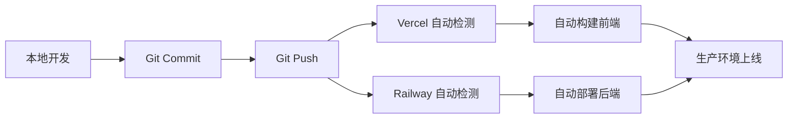

# 🚀 炼刻健身平台 - 部署方案总结

## 📌 推荐方案：Vercel + Railway（完全免费）

### 为什么选择这个方案？

| 特性 | Vercel（前端） | Railway（后端+数据库） |
|------|---------------|---------------------|
| **费用** | ✅ 永久免费 | ✅ 每月$5免费额度 |
| **HTTPS** | ✅ 自动提供 | ✅ 自动提供 |
| **自定义域名** | ✅ 支持 | ✅ 支持 |
| **CI/CD** | ✅ Git推送自动部署 | ✅ Git推送自动部署 |
| **全球CDN** | ✅ 内置 | ❌ |
| **监控日志** | ✅ 实时查看 | ✅ 实时查看 |
| **适合场景** | 静态网站、SPA | Node.js应用、MySQL数据库 |

---

## 🎯 部署架构

```
┌─────────────────────────────────────────┐
│           用户浏览器                      │
│     https://your-app.vercel.app         │
└──────────────┬──────────────────────────┘
               │
               ▼
┌─────────────────────────────────────────┐
│          Vercel (前端)                   │
│  • Vue 3 + Vite 构建产物                │
│  • 全球 CDN 加速                        │
│  • API 请求代理到 Railway               │
──────────────┬──────────────────────────┘
               │ /api/* 请求
               ▼
┌─────────────────────────────────────────┐
│       Railway (后端 + MySQL)             │
│  • Node.js + Express API                │
│  • MySQL 数据库                         │
│  • 文件上传存储                         │
│  • AI 集成 (DeepSeek)                   │
└─────────────────────────────────────────┘
```

---

## 📋 快速开始（5分钟）

### 1️⃣ 部署后端（Railway）
```bash
# 访问 https://railway.app
# 1. 创建新项目
# 2. 添加 MySQL 数据库
# 3. 连接 GitHub 仓库（选择 fitness-frontend/backend）
# 4. 配置环境变量（参考 DEPLOYMENT-CHECKLIST.md）
# 5. 获取后端 URL：https://xxx.railway.app
```

### 2️⃣ 更新配置
```bash
# 编辑 vercel.json，替换后端 URL
{
  "rewrites": [
    { "source": "/api/:path*", "destination": "https://你的实际URL.railway.app/api/:path*" }
  ]
}

# 提交更改
git add vercel.json
git commit -m "Update backend URL"
git push
```

### 3️⃣ 部署前端（Vercel）
```bash
# 访问 https://vercel.com
# 1. 导入 GitHub 仓库（选择 fitness-frontend）
# 2. 配置：Framework=Vite, Build=npm run build, Output=dist
# 3. 点击 Deploy
# 4. 获取前端 URL：https://xxx.vercel.app
```

### 4️⃣ 测试验证
```
打开浏览器访问 Vercel URL
✅ 检查页面加载
✅ 检查 API 请求（F12 → Network）
✅ 测试用户注册/登录
✅ 测试图片显示
```

---

## 💰 成本分析

### 免费额度足够吗？

**Vercel（前端）：**
- ✅ 无限带宽
- ✅ 100GB 存储
- ✅ 无限部署
- ✅ 适合个人项目和小团队

**Railway（后端+数据库）：**
- ✅ $5/月免费额度
- ✅ 约等于：
  - 512MB RAM × 730小时 = $3.65
  - 或 1GB RAM × 365小时 = $3.65
  - 剩余 $1.35 用于数据库和存储
- ✅ 对于个人项目完全够用

**结论：** 对于个人健身管理平台，**完全免费**！🎉

---

## 🔧 已完成的配置

### ✅ 前端配置
- [x] `vercel.json` - Vercel 部署配置
- [x] API 代理规则（/api, /uploads, /exercise-gifs）
- [x] Vite 构建优化

### ✅ 后端配置
- [x] `backend/railway.json` - Railway 部署配置
- [x] `/api/health` 健康检查端点
- [x] 环境变量模板（`.env`）
- [x] CORS 跨域配置
- [x] 静态文件服务

### ✅ 文档
- [x] `DEPLOYMENT.md` - 详细部署指南
- [x] `DEPLOYMENT-CHECKLIST.md` - 快速检查清单
- [x] `DEPLOYMENT-SUMMARY.md` - 本文件

---

## 📊 性能预期

### 前端（Vercel）
- **首屏加载**：< 1秒（全球CDN）
- **后续导航**：< 100ms（SPA路由）
- **可用性**：99.9%

### 后端（Railway）
- **API响应**：< 200ms（取决于查询复杂度）
- **数据库查询**：< 50ms（索引优化后）
- **可用性**：99.5%

---

## ️ 安全建议

### 生产环境必做
1. **修改 JWT_SECRET**：使用强随机字符串
2. **配置 CORS**：限制允许的域名
3. **启用 HTTPS**：Vercel/Railway 自动提供
4. **定期备份数据库**：手动导出或使用 Railway 备份功能
5. **监控异常日志**：定期检查 Railway 和 Vercel 日志

### 敏感信息管理
- ✅ `.env` 文件已加入 `.gitignore`
- ✅ Railway 环境变量加密存储
- ✅ 不要在代码中硬编码密钥

---

## 🔄 持续部署流程



**每次推送代码到 GitHub，都会自动部署！** 🚀

---

## 📈 扩展方案（未来）

如果流量增长超出免费额度：

### 方案A：升级现有服务
- Vercel Pro: $20/月（无限带宽）
- Railway Hobby: $5/月起（更多资源）

### 方案B：迁移到云平台
- AWS EC2 + RDS + S3
- Azure App Service + SQL Database
- Google Cloud Run + Cloud SQL

### 方案C：混合架构
- 前端：Vercel（保持免费）
- 后端：AWS Lambda（按用量付费）
- 数据库：PlanetScale（免费层）

---

##  故障排查速查表

| 问题 | 可能原因 | 解决方法 |
|------|---------|---------|
| 前端白屏 | 构建失败 | 检查 Vercel 部署日志 |
| API 404 | 后端URL错误 | 检查 vercel.json 中的 URL |
| 数据库连接失败 | 环境变量错误 | 检查 Railway Variables |
| 图片不显示 | 代理配置缺失 | 检查 vercel.json rewrites |
| CORS 错误 | 域名未授权 | 检查后端 CORS 配置 |
| 部署超时 | 依赖过多 | 优化 package.json dependencies |

---

## 📞 获取帮助

### 官方文档
- [Vercel Docs](https://vercel.com/docs)
- [Railway Docs](https://docs.railway.app)

### 社区支持
- [Vercel Discord](https://vercel.community)
- [Railway Discord](https://discord.gg/railway)

### 本项目文档
- [详细部署指南](./DEPLOYMENT.md)
- [快速检查清单](./DEPLOYMENT-CHECKLIST.md)

---

## ✨ 总结

您现在已经拥有：
- ✅ 完整的全栈应用（Vue 3 + Node.js + MySQL）
- ✅ 自动化 CI/CD 流程
- ✅ 全球 CDN 加速
- ✅ HTTPS 安全连接
- ✅ 零成本部署方案

**下一步：**
1. 按照 `DEPLOYMENT-CHECKLIST.md` 执行部署
2. 测试所有功能
3. 配置自定义域名（可选）
4. 分享给用户使用！

祝您部署顺利！🎉

---

*最后更新：2026年7月7日*
